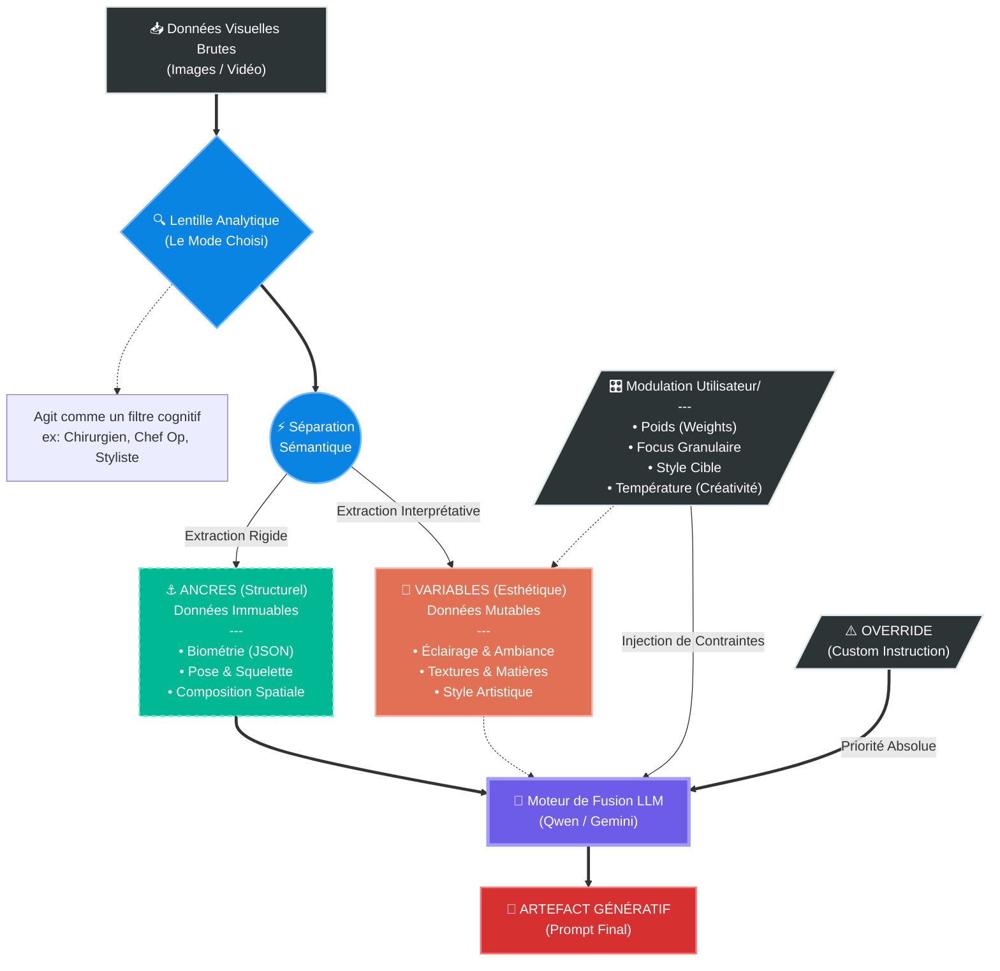

# Architecture Logique : Le Principe de Découplage Sémantique

Ce document formalise l'architecture logique d'**Artidicia**. Il illustre comment le système sépare les données structurelles (Ancres) des données esthétiques (Variables) pour permettre une création contrôlée par l'IA.

## Diagramme de Flux

## Explication des Composants

### 1. Phase 1 : La Déconstruction (Le Prisme)
L'image brute entre dans le système et passe par la **Lentille Analytique** (le Mode sélectionné dans l'UI).
*   Cette lentille agit comme un filtre cognitif.
*   *Exemple* : Si la lentille est "Biométrie", elle ignore les couleurs pour se concentrer sur la géométrie.

### 2. Le Flux Dissocié (Le Cœur du Système)
Le système sépare l'information visuelle en deux flux distincts :
*   **Les Ancres (Anchors)** : Ce sont les éléments structurels que l'on souhaite conserver.
    *   *Exemples* : Le JSON biométrique, la pose exacte, la composition spatiale.
    *   *Règle* : Ces données sont traitées comme immuables ou prioritaires.
*   **Les Variables** : Ce sont les éléments esthétiques que l'on souhaite modifier ou laisser l'IA interpréter.
    *   *Exemples* : L'éclairage, le grain de peau, le style artistique, l'ambiance.
    *   *Règle* : Ces données sont mutables et sujettes à l'hallucination créative.

### 3. Phase 2 : La Reconstruction (Le Mixage)
Le **Moteur de Fusion LLM** (Qwen, Gemini, etc.) recombine ces deux flux.
*   Il utilise les **Ancres** comme contraintes rigides.
*   Il utilise les **Variables** comme matière première créative.
*   L'utilisateur intervient via la **Modulation** (Poids, Focus) pour ajuster l'équilibre entre conservation et transformation.

C'est ce découplage qui permet à Artidicia de ne pas simplement "décrire" une image, mais de la **réinventer** tout en gardant son essence.

---

## Évolutions Récentes

### 1. **Granular Focus** (Contrôle Chirurgical)
Au-delà du poids global d'une image, l'utilisateur peut désormais spécifier **quel aspect précis** doit être extrait :
*   **Options disponibles** : Character/Face, Pose/Body, Clothing, Background, Colors/Palette, Style/Ambiance
*   **Injection dans le prompt** : Ces instructions sont ajoutées uniquement pour les modes de fusion
*   **Exemple** : "Image 1 : Weight 1.5, Focus: Pose/Body" → L'IA extrait uniquement la pose, ignore le reste

### 2. **ALT POV - Sélection de Looks**
Le mode `alt_pov` génère **28 looks alternatifs** (dark → light → fetish). Nouvelles fonctionnalités :
*   **Sélection multiselect** : L'utilisateur choisit quels looks générer (ex: seulement LOOK 3, 7, 21, 26)
*   **Comportement par défaut** : Aucun look présélectionné (force l'utilisateur à choisir)
*   **Injection de contrainte** : Un override critique est injecté dans le prompt pour forcer l'IA à ignorer les looks non sélectionnés
*   **Looks 1-22** : Perspectives alternatives (Latex Noir, X-Ray, Thermal, Shibari, etc.)
*   **Looks 23-28** : Série fetish intégrée (Latex Chrome, Sheer Bondage, Leather & Lace, Wet Look, Dominatrix, Underboob)

### 3. **Smart Tabs pour ALT POV**
Organisation visuelle des **28 looks** par **mood** :
*   🌑 **DARK** (1-5) : Latex, Leather, Industrial
*   🔌 **TECH** (6-10) : X-Ray, CCTV, Thermal
*   🌈 **COLOR** (11-15) : Neon, Anamorphic, Reflections
*   ✨ **LIGHT** (16-20) : Soft Focus, Golden Hour, Ethereal
*   🔥 **BONUS** (21-22) : Lingerie Riot, Booty Shorts
*   💋 **FETISH** (23-28) : Latex Chrome, Bondage, Leather & Lace, Wet Look, Dominatrix, Underboob

Chaque look est affiché dans un `text_area` dédié pour copie facile.

### 4. **Dataset Training System**
Système de collecte de données pour entraînement futur :
*   **Rating** : Système d'étoiles (1-5) pour évaluer la qualité du prompt généré
*   **Commentaire** : Note optionnelle (ex: "Perfect lighting, bad hands")
*   **Stockage SQLite** : Sauvegarde de l'image source, mode, style, modèle, prompt, rating, commentaire
*   **Historique** : Visualisation des 10 dernières analyses avec possibilité de re-télécharger ou supprimer

### 5. **Look Fidelity Slider** (ALT POV)
Curseur de contrôle pour équilibrer **LOOK prescriptif** vs **Source images** :
*   **Curseur** : 0% (Source Fidelity) ←→ 100% (Look Fidelity)
*   **Défaut** : 70% (LOOK dominant mais adaptatif)
*   **Comportement** :
    *   **0-30%** : Garde les vêtements/pose de la source, applique seulement le style du LOOK (lighting, colors)
    *   **31-60%** : Blend entre LOOK et source (hybride latex-dress, pose adaptée)
    *   **61-85%** : LOOK dominant (remplace vêtements/pose, garde biométrie)
    *   **86-100%** : LOOK pur (source = biométrie uniquement, tout le reste = LOOK strict)
*   **Préservation** : Le visage et la morphologie restent **100% fidèles à la source** à tous les niveaux
*   **Use case** : Permet de garder ses vêtements tout en appliquant l'esthétique d'un LOOK, ou inversement

Ces évolutions renforcent le principe de **contrôle granulaire** tout en préservant la séparation Ancres/Variables.

