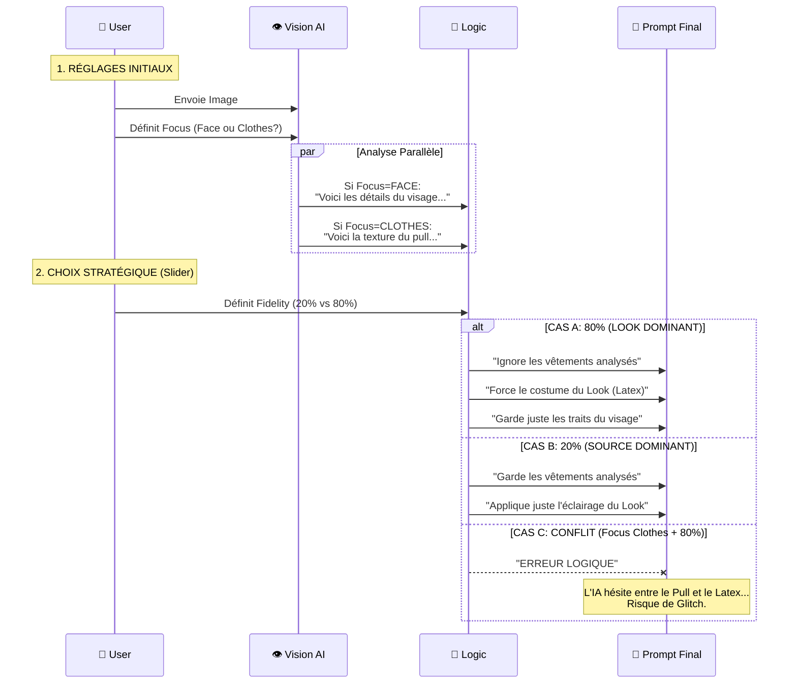

```mermaid
sequenceDiagram
    participant User as 👤 User
    participant Vision as 👁️ Vision AI
    participant Logic as 🧠 Logic
    participant Result as 🎨 Prompt Final

    Note over User: 1. RÉGLAGES INITIAUX
    User->>Vision: Envoie Image
    User->>Vision: Définit Focus (Face ou Clothes?)

    par Analyse Parallèle
        Vision->>Logic: Si Focus=FACE:<br/>"Voici les détails du visage..."
        Vision->>Logic: Si Focus=CLOTHES:<br/>"Voici la texture du pull..."
    end

    Note over User: 2. CHOIX STRATÉGIQUE (Slider)
    User->>Logic: Définit Fidelity (20% vs 80%)
    
    alt CAS A: 80% (LOOK DOMINANT)
        Logic->>Result: "Ignore les vêtements analysés"
        Logic->>Result: "Force le costume du Look (Latex)"
        Logic->>Result: "Garde juste les traits du visage"
    else CAS B: 20% (SOURCE DOMINANT)
        Logic->>Result: "Garde les vêtements analysés"
        Logic->>Result: "Applique juste l'éclairage du Look"
    else CAS C: CONFLIT (Focus Clothes + 80%)
        Logic--x Result: "ERREUR LOGIQUE"
        Note over Result: L'IA hésite entre le Pull et le Latex...<br/>Risque de Glitch.
    end
```
