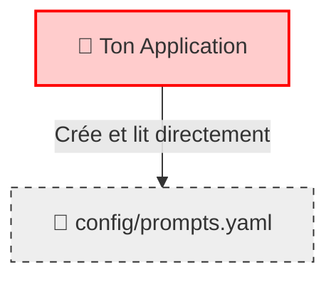
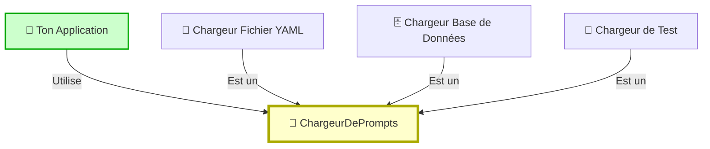

# 🎓 COMPRENDRE L'INJECTION DE DÉPENDANCES (VISUELLEMENT)

Tu m'as demandé un schéma et un plan concret basé sur tes **prompts**. C'est une excellente idée car c'est très visuel.

Imagine que ton application (`GeminiApp`) a besoin de **Prompts** pour fonctionner.

---

## 1. LE PROBLÈME : LE COUPLAGE FORT (SANS INJECTION)

C'est comme si ta lampe était **soudée** directement au mur. Tu ne peux pas la déplacer, tu ne peux pas la changer.

### ❌ Schéma "Soudé" (Mauvais)



**Pourquoi c'est nul ?**
*   Si tu veux charger les prompts depuis une base de données ? **Impossible**, faut réécrire l'app.
*   Si tu veux tester l'app avec un seul petit prompt de test ? **Impossible**, elle va charger les 1000 lignes de `prompts.yaml`.

---

## 2. LA SOLUTION : L'INJECTION DE DÉPENDANCES

C'est comme une **prise électrique**. Ta lampe (l'App) a juste besoin d'une prise. Elle s'en fiche de savoir si l'électricité vient du nucléaire, du solaire ou d'un générateur.

### ✅ Schéma "Prise Électrique" (Bon)



**Pourquoi c'est génial ?**
*   Au démarrage, tu **choisis** ce que tu branches dans la prise.
*   L'application dit juste : *"Donne-moi des prompts, je m'en fous d'où ils viennent"*.

---

## 3. EXEMPLE CONCRET (CODE SIMPLIFIÉ)

Regarde la différence. C'est subtil mais puissant.

### ❌ AVANT (Ce que tu fais souvent)

```python
class GeminiApp:
    def __init__(self):
        # L'appli va cherchez ELLE-MÊME le fichier.
        # Si le fichier change de nom, l'appli plante.
        self.prompts = yaml.load("config/prompts.yaml") 

    def generer(self):
        print(self.prompts['style_transfer'])
```

### ✅ APRÈS (Avec Injection)

On crée une "étiquette" (une classe) pour gérer le chargement.

```python
# 1. On crée un "Chargeur" (le spécialiste)
class ChargeurDePrompts:
    def charger(self):
        return yaml.load("config/prompts.yaml")

# 2. L'App demande un chargeur (n'importe lequel !)
class GeminiApp:
    def __init__(self, chargeur):
        # "Je ne sais pas d'où ça vient, mais je fais confiance au chargeur"
        self.prompts = chargeur.charger()

    def generer(self):
        print(self.prompts['style_transfer'])
```

### 🚀 LE SCÉNARIO MAGIQUE (POURQUOI ON FAIT ÇA)

Imagine demain tu veux stocker tes prompts **en ligne** (sur le Cloud) pour les partager avec ton équipe.

1.  **Sans injection** : Tu dois ouvrir `GeminiApp` et modifier tout le code de chargement. Risque de bugs ! 😱
2.  **Avec injection** : Tu crées juste un nouveau chargeur `ChargeurCloud` et tu le donnes à l'app. Tu ne touches PAS à `GeminiApp`. 😎

```python
# Nouveau chargeur (sans toucher à l'App)
class ChargeurCloud:
    def charger(self):
        return telecharger_depuis_internet("http://mon-site.com/prompts.json")

# Au démarrage de l'app :
mon_chargeur = ChargeurCloud() # Hop, on change ici
app = GeminiApp(mon_chargeur)  # L'app marche pareil !
```

---

## RÉSUMÉ

*   **Injection** = Passer les outils (dépendances) au lieu de les laisser les fabriquer eux-mêmes.
*   **Avantage** = Tu peux changer les outils sans changer l'ouvrier (l'application).
